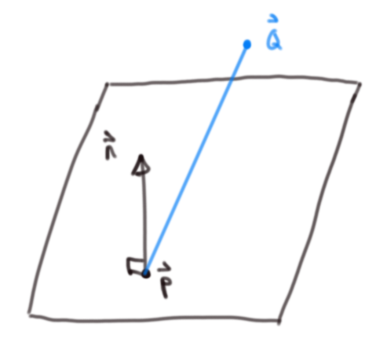
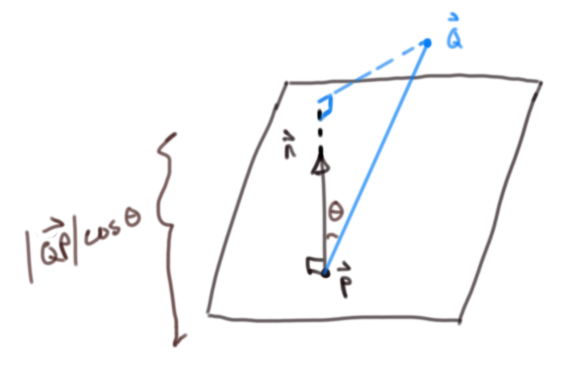

Title: Distance to Plane and Ray Plane Intersection
Date:  30.03.2022
Categories: Math
#--

Motivation
==========================================================================================================================
*While watching [Casey Muratori write a raytracer](https://www.youtube.com/watch?v=pq7dV4sR7lg) recently, I noticed he characterized the equation of a plane equation in a weird way, so I decided to do  a quick derivation

( tl;dr, his notation is ambiguous and the constant *d* is accidentally abused)

Original description
==========================================================================================================================
Casey Muratori describes the equation of a plane as a normal vector dotted with a point on the plane (in his notation) plus a scalar *d* equaling zero: $N^T \cdot P + d = 0$:

Visually (using standard notation):

    
    
Arbitrary plane with a point on the plane 

    
    
$\vec{N} \cdot \vec{P}$ is indeed the distance from the origin to the plane

It's clear that *d* in this case is the negative distance from the origin to the plane; so, he's right about that, but can this be the same *d* I remember from the traditional implicit plane equation, moreover how does this describe a plane at all?

Let's confirm the general distance to a plane as an excuse to draw more and then explicitly give the formula for a plane. See what sticks.

Closest distance to a plane from an arbitrary non-coplanar point:
==========================================================================================================================

Problem setup
--------------------------------------------------------------------------------------------------------------------------

    
    
Some arbitrary plane with some non-coplanar point Q with the relative position vector 
    $
        \vec{Q} - \vec{P}  = \vec{QP} 
    $
    drawn in blue
    

    
    
The same problem from a different perspective

Via projection of point onto normal:
--------------------------------------------------------------------------------------------------------------------------

We've already done this when visualizing Casey Muratori's expression, but let's repeat to be thorough

    
    
The projection length of the relative position vector and the plane normal

    

The dot product of the relative position vector and the normal:

$\vec{QP} = \vec{Q} - \vec{P}$ 

By definition of the dot product 
$\vec{QP} \cdot \vec{n} = \lvert \lvert \vec{QP} \rvert \rvert \lvert \lvert \vec{n} \rvert \rvert \cos{\theta}$

$ \implies \lvert \lvert \vec{QP} \rvert \rvert \cos{\theta} = \frac{\vec{QP} \cdot \vec{n}}{ \lvert \lvert \vec{n} \rvert \rvert}$

In the case that the normal is unit length, this simplifies to our first result

Via ray intersection
--------------------------------------------------------------------------------------------------------------------------

It's always nice to get the same result in different ways to build up intuition.

    
    

        The first diagram with the ray intersection point 
        $
            \vec{P}^\prime 
        $
    

    
    
The same as above but from a different perspective

The vector equation of a ray (really a line segment -- we just discard negative scaling values ℓ for the ray):  
$\vec{ray} = \vec{r_0} + ℓ \vec{rd}$

Where $\vec{rd}$ is a unit vector in the ray direction.

In the case of the ray intersection with the plane, the ray direction is the negative unit vector of whatever the normal vector happens to be; the ray origin is our arbitrary non-coplanar point $Q$

$\vec{rd} = \frac{\vec{n}}{\lvert \lvert \vec{n} \rvert \rvert}$
$\vec{r_0} = \vec{Q}$

Substituting this into the plane equation:

$\left( \vec{Q} - ℓ \frac{\vec{n}}{\lvert \lvert \vec{n} \rvert \rvert} - \vec{P} \right) \cdot \vec{n} = 0$

Solving for ℓ:
(Rearranging and using properties of the dot product (distributive & $\vec{a} \cdot \vec{a} = {\lvert \lvert \vec{a} \rvert \rvert}^2$))

$\left(\vec{Q} - \vec{P} \right) \cdot \vec{n} - ℓ \frac{\vec{n}}{\lvert \lvert \vec{n} \rvert \rvert} \cdot \vec{n} = 0$

$\left(\vec{Q} - \vec{P} \right) \cdot \vec{n} - ℓ \frac{{\lvert \lvert \vec{n} \rvert \rvert}^2}{\lvert \lvert \vec{n} \rvert \rvert} = 0$

$\vec{QP} \cdot \vec{n} - ℓ \lvert \lvert \vec{n} \rvert \rvert = 0$

$ℓ = \frac{\vec{QP} \cdot \vec{n}}{\lvert \lvert \vec{n} \rvert \rvert}$

And again, in the case that the normal is unit length, this simplifies to our first result.

Plane equation (vector and implicit)
==========================================================================================================================

The derived expression in the video originally rubbed me the wrong way
because it accidentally conflates the one equation with another. Let's correct that by recovering the implicit formula from the vector one.
After all that drawing, it's nice to just do some simple algebra.

From [wikipedia](https://en.wikipedia.org/wiki/Plane_(geometry)):  
*"In a manner analogous to the way lines in a two-dimensional space are described using a point-slope form for their equations, planes in a three dimensional space have a natural description using a point in the plane and a vector orthogonal to it (the normal vector) to indicate its "inclination".*

A plane is defined for all $\vec{P^{\prime}}$ if $\left( \vec{P^{\prime}} - \vec{P} \right) \cdot \vec{n} = 0$, i.e. their dot product is zero (they're orthogonal to each other)

We can easily recover the more familiar implicit form ($Ax + By + Cz = d$) if we write out the expression in scalar form:

Some normal to the plane
$\vec{n} = \left( A, B, C \right)$ 
And some point on the plane
$\vec{P} = \left( a, b, c \right)$

And some variable point $\vec{P^{\prime}}$ 
$\vec{P^{\prime}} = \left( x, y, z \right)$ 

$ \implies \vec{P^{\prime}} - \vec{P} = \left(x - a, y - b, z - c \right)$

And our plane is then: $\left( \vec{P^{\prime}} - \vec{P} \right) \cdot \vec{n} = 0 = \left(x - a, y - b, z - c \right) \cdot \left( A, B, C \right) $

Expanding the dot product:  
$\left(x - a, y - b, z - c \right) \cdot \left( A, B, C \right) = A\left(x - a \right) + B\left(y - b \right) +  C\left(z - b \right)$

Distributing and collecting constants:  
$A\left(x - a \right) + B\left(y - b \right) +  C\left(z - b \right) = Ax + By + Cz + \left(Aa + Bb + Cc \right) = 0$

Rewriting the constant values as a new constant $-d$: 
$\implies d = Aa + Bb + Cc$ 
(or vectorially: $\vec{P} \cdot \vec{n}$)

$Ax + By + Cz - d = 0 \implies Ax + By + Cz = d$

Visual confirmation with 3D graphing software (Geogebra):
-------------------------------------------------------------------------------------------------------------------------
Arbitrarily picking a simple example, let the plane be $x + y + z = 4$

Thus, the normal vector is $\left( 1, 1, 1 \right)$ and the "$d$" value is $4$

    
    
Vector along the normal to plane that is scaled to the derived length

    
    
Vector along the normal to plane that is scaled to the the "$d$" length, in this case 4

Wrapping up and stray thoughts:
==========================================================================================================================

Simply put, Casey is abusing the notation for *d*. His implicit form is correct, but he skips a crucial point of showing that the expanded dot produt constants all get subsumed into a single constant. Fortunately, this doesn't really matter as you don't need to know this in order to implement the simple intersection check for a plane.

His [original expression](https://www.youtube.com/watch?v=pq7dV4sR7lg) $\vec{n} \cdot \vec{p}$ where he says $\vec{p}$ is a point in the plane expresses the distance to the plane

(Also, pet peeve, but why can't programmers use standard standard mathematical notation ( like this [guy](http://lousodrome.net/blog/light/2020/07/03/intersection-of-a-ray-and-a-plane/) )
Using non-standard notation and not being explicit with a derivation has caused me many issues before (see my simple physics engine article) 
 -- that said, I'm sure programmers feel similarly if they ever see scientists Matlab/ Python / Julia / R code)

All said and done, this is definitely all unnecessary minutia on some level, but it fits the spirit of the handmade ethos hopefully.

Now, if only I knew half of what Casey does or could program an even smaller fraction as well as him... guess it's back to work.

Cheers