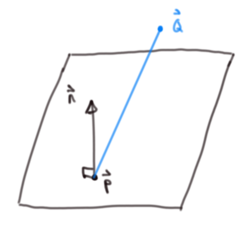
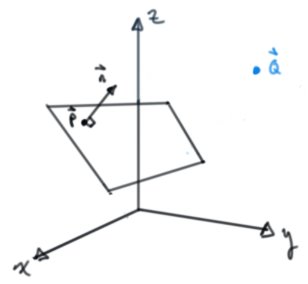
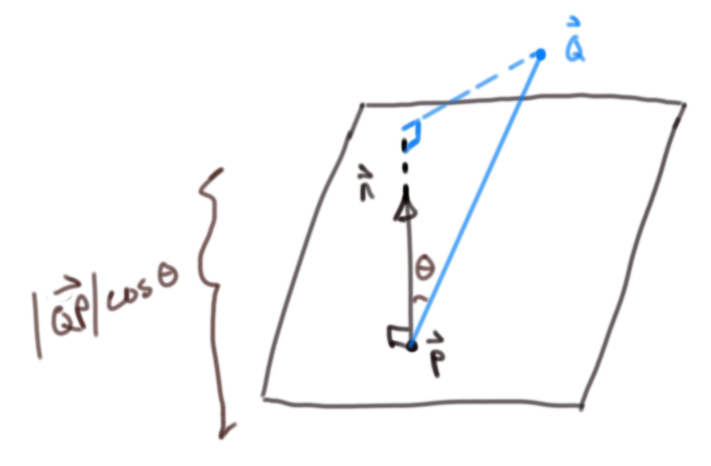
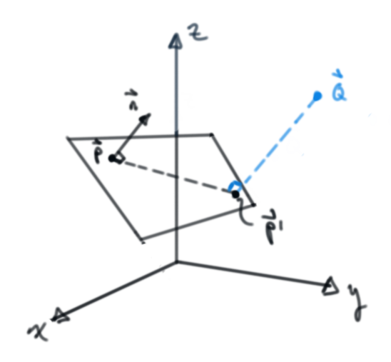
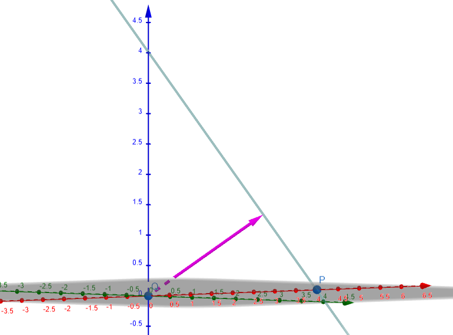
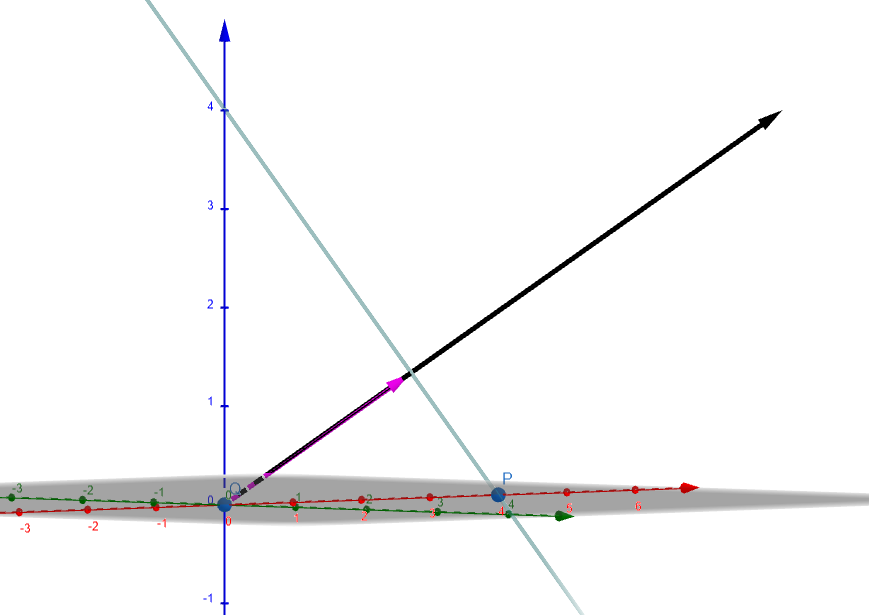

Title: Distance between point and plane
Date:  30.03.2022
Categories: Math
#--

Motivation
==========================================================================================================================
*While watching [Casey Muratori write a raytracer](https://www.youtube.com/watch?v=pq7dV4sR7lg) recently, I noticed that he incorrectly characterized the plane equation. So of course I had to do a quick derivation to convince myself*

Plane equation derivation
==========================================================================================================================

From the wiki article:
"In a manner analogous to the way lines in a two-dimensional space are described using a point-slope form for their equations, planes in a three dimensional space have a natural description using a point in the plane and a vector orthogonal to it (the normal vector) to indicate its "inclination".

For a given normal vector: $\vec{n}$ 
And a vector in the plane: $\vec{P^{\prime}} - \vec{P}$

A plane is defined for all $\vec{P^{\prime}}$ such that their dot product is zero (they're orthogonal to each other)
$\left( \vec{P^{\prime}} - \vec{P} \right) \cdot \vec{n} = 0$

We can easily recover the more familiar implicit form ($Ax + By + Cz = d$) if we write out the expression in scalar form:

$\vec{n} = \left( A, B, C \right)$ 
$\vec{P} = \left( a, b, c \right)$ 
$\vec{P^{\prime}} = \left( x, y, z \right)$ 

$ \implies \vec{P^{\prime}} - \vec{P} = \left(x - a, y - b, z - c \right)$

And $\left( \vec{P^{\prime}} - \vec{P} \right) \cdot \vec{n} = 0 = 
\left( A, B, C \right) \cdot \left(x - a, y - b, z - c \right)$

Expanding the dot product:  
$\left( A, B, C \right) \cdot \left(x - a, y - b, z - c \right) = A\left(x - a \right) + B\left(y - b \right) +  C\left(z - b \right)$

Distributing and collecting constants:  
$A\left(x - a \right) + B\left(y - b \right) +  C\left(z - b \right) = Ax + By + Cz + \left(Aa + Bb + Cc \right) = 0$

Rewriting the constant values as a new constant $-d$: 
$\implies d = Aa + Bb + Cc$ 
(or vectorially: $\vec{P} \cdot \vec{n}$)

$Ax + By + Cz - d = 0 \implies Ax + By + Cz = d$

Closest distance to a plane from an arbitrary non-coplanar point:
==========================================================================================================================

Problem setup
-------------------------------------------------------------------------------------------------------------------------

Consider the following diagram:

    
    
Some arbitrary plane with some non-coplanar point Q with the relative position vector 
    $
        \vec{Q} - \vec{P}  = \vec{QP} 
    $
    drawn in blue
    

    
    
The same problem from a different perspective

Via projection of point onto normal:
--------------------------------------------------------------------------------------------------------------------------

    
    
The projection length of the relative position vector and the plane normal

    

The dot product of the relative position vector and the normal:

$\vec{QP} = \vec{Q} - \vec{P}$ 

By definition of the dot product 
$\vec{QP} \cdot \vec{n} = \lvert \lvert \vec{QP} \rvert \rvert \lvert \lvert \vec{n} \rvert \rvert \cos{\theta}$

$ \implies \lvert \lvert \vec{QP} \rvert \rvert \cos{\theta} = \frac{\vec{QP} \cdot \vec{n}}{ \lvert \lvert \vec{n} \rvert \rvert}$

Via ray intersection
--------------------------------------------------------------------------------------------------------------------------

    
    

        The first diagram with the ray intersection point 
        $
            \vec{P}^\prime 
        $
    

    
    
The same as above but from a different perspective

The vector equation of a ray (really a line -- we just discard negative scaling values ℓ for the ray):  
$\vec{ray} = \vec{r_0} + ℓ \vec{rd}$

Where $\vec{rd}$ is a unit vector in the ray direction.

In the case of the ray intersection with the plane, the ray direction is the negative unit vector of whatever the normal vector happens to be; the ray origin is our arbitrary non-coplanar point $Q$

$\vec{rd} = \frac{\vec{n}}{\lvert \lvert \vec{n} \rvert \rvert}$
$\vec{r_0} = \vec{Q}$

Substituting this into the plane equation:

$\left( \vec{Q} - ℓ \frac{\vec{n}}{\lvert \lvert \vec{n} \rvert \rvert} - \vec{P} \right) \cdot \vec{n} = 0$

Solving for ℓ:
(Rearranging and using properties of the dot product (distributive & $\vec{a} \cdot \vec{a} = {\lvert \lvert \vec{a} \rvert \rvert}^2$))

$\left(\vec{Q} - \vec{P} \right) \cdot \vec{n} - ℓ \frac{\vec{n}}{\lvert \lvert \vec{n} \rvert \rvert} \cdot \vec{n} = 0$

$\left(\vec{Q} - \vec{P} \right) \cdot \vec{n} - ℓ \frac{{\lvert \lvert \vec{n} \rvert \rvert}^2}{\lvert \lvert \vec{n} \rvert \rvert} = 0$

$\vec{QP} \cdot \vec{n} - ℓ \lvert \lvert \vec{n} \rvert \rvert = 0$

$ℓ = \frac{\vec{QP} \cdot \vec{n}}{\lvert \lvert \vec{n} \rvert \rvert}$

Visual confirmation with 3D graphing software (Geogebra):
-------------------------------------------------------------------------------------------------------------------------
Arbitrarily picking a simple example, let the plane be $x + y + z = 4$

Thus, the normal vector is $\left( 1, 1, 1 \right)$ and the "$d$" value is $4$

    
    
Vector along the normal to plane that is scaled to the derived length

    
    
Vector along the normal to plane that is scaled to the the "$d$" length, in this case 4

Wrapping up:
==========================================================================================================================

Casey's idea that the "$d$" value generally represents distance along the plane's normal is incorrect.
Fortunately, it doesn't really matter as you don't need to know this in order to implement the simple intersection check for a plane.

All said and done, this is definitely all unnecessary minutia on some level, but it fits the spirit of the handmade ethos hopefully.

Now, if only I knew half of what Casey does or could program a significantly smaller fraction as well as him... guess it's back to work.

Cheers