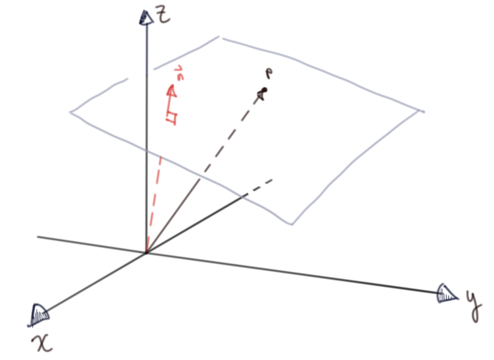

Title: Distance to Plane and Ray Plane Intersection
Date:  30.03.2022
Categories: Graphics
#--

Motivation
==========================================================================================================================
*While watching [Casey Muratori write a raytracer](https://www.youtube.com/watch?v=pq7dV4sR7lg) recently, I noticed he characterized the equation of a plane equation in a weird way, so I decided to write out a quick derivation.

Problem Set Up
==========================================================================================================================
What seemed weird to me was his expression for a plane:  $N^T \cdot P + d = 0$
Where $N^T$ is a normal to the plane, *P* is a point on the plane and *d* is the distance to the plane. The operator is the scalar product.

Non-standard notation aside, this is just the negative distance to a plane and isn't an equation to generate a plane.

    
    
Arbitrary plane with a point on the plane 

    
    
$\vec{N} \cdot \vec{P}$ is indeed the distance from the origin to the plane

Let's make this explicit by showing the distance to a plane from any arbitrary point

Distance to a plane
==========================================================================================================================

Via projection of point onto normal:
--------------------------------------------------------------------------------------------------------------------------

    
    
The projection length of the relative position vector and the plane normal

    

The dot product of the relative position vector and the normal:

$\vec{QP} = \vec{Q} - \vec{P}$ 

By definition of the dot product 
$\vec{QP} \cdot \vec{n} = \lvert \lvert \vec{QP} \rvert \rvert \lvert \lvert \vec{n} \rvert \rvert \cos{\theta}$

$ \implies \lvert \lvert \vec{QP} \rvert \rvert \cos{\theta} = \frac{\vec{QP} \cdot \vec{n}}{ \lvert \lvert \vec{n} \rvert \rvert}$

In the case that the normal is unit length, this simplifies to our first result

Via ray intersection
--------------------------------------------------------------------------------------------------------------------------

It's always encouraging to see the same result in multiple ways:

    
    

        The first diagram with the ray intersection point 
        $
            \vec{P}^\prime 
        $
    

    
    
The same as above but from a different perspective

The vector equation of a ray (really a line segment -- we just discard negative scaling values ℓ for the ray):  
$\vec{ray} = \vec{r_0} + ℓ \vec{rd}$

Where $\vec{rd}$ is a unit vector in the ray direction.

In the case of just looking for the distance to the plane, the ray direction is $\pm$ the unit vector of whatever the normal vector happens to be depending on what side of the plane the ray origin is on; where the ray origin is our arbitrary point $Q$

$\vec{rd} = \frac{\vec{n}}{\lvert \lvert \vec{n} \rvert \rvert}$ 
$\vec{r_0} = \vec{Q}$

Substituting this into the plane equation:

$\left( \vec{Q} - ℓ \frac{\vec{n}}{\lvert \lvert \vec{n} \rvert \rvert} - \vec{P} \right) \cdot \vec{n} = 0$

Solving for ℓ:
(Rearranging and using properties of the dot product (distributive & $\vec{a} \cdot \vec{a} = {\lvert \lvert \vec{a} \rvert \rvert}^2$))

$\left(\vec{Q} - \vec{P} \right) \cdot \vec{n} - ℓ \frac{\vec{n}}{\lvert \lvert \vec{n} \rvert \rvert} \cdot \vec{n} = 0$

$\left(\vec{Q} - \vec{P} \right) \cdot \vec{n} - ℓ \frac{{\lvert \lvert \vec{n} \rvert \rvert}^2}{\lvert \lvert \vec{n} \rvert \rvert} = 0$

$\vec{QP} \cdot \vec{n} - ℓ \lvert \lvert \vec{n} \rvert \rvert = 0$

$ℓ = \frac{\vec{QP} \cdot \vec{n}}{\lvert \lvert \vec{n} \rvert \rvert}$

And again, in the case that the normal is unit length, this simplifies to our first result.

Equation of a plane
==========================================================================================================================

Now that we've gorily shown that the first expression in the video is indeed the distance from the origin to the plane, we can now show that the second expression is an accidental sleight of hand by deriving the equation of a plane.

From [wikipedia](https://en.wikipedia.org/wiki/Plane_(geometry)):  
*"In a manner analogous to the way lines in a two-dimensional space are described using a point-slope form for their equations, planes in a three dimensional space have a natural description using a point in the plane and a vector orthogonal to it (the normal vector) to indicate its "inclination".*

    
Some visual intuition:

    
    
The dot product of a relative position vector and a normal must be zero to be on a plane

A plane is defined for all $\vec{P^{\prime}}$ if $\left( \vec{P^{\prime}} - \vec{P} \right) \cdot \vec{n} = 0$, i.e. their dot product is zero (they're orthogonal to each other)

We can easily recover the more familiar implicit form ($Ax + By + Cz = d$) if we write out the expression in scalar form:

Some chosen inclination (a normal to the plane)
$\vec{n} = \left( A, B, C \right)$ 
And some chosen point on the plane
$\vec{P} = \left( a, b, c \right)$

And a variable point $\vec{P^{\prime}}$ 
$\vec{P^{\prime}} = \left( x, y, z \right)$ 

$ \implies \vec{P^{\prime}} - \vec{P} = \left(x - a, y - b, z - c \right)$

And our plane is then: $\left( \vec{P^{\prime}} - \vec{P} \right) \cdot \vec{n} = 0 = \left(x - a, y - b, z - c \right) \cdot \left( A, B, C \right) $

Expanding the dot product:  
$\left(x - a, y - b, z - c \right) \cdot \left( A, B, C \right) = A\left(x - a \right) + B\left(y - b \right) +  C\left(z - b \right)$

Distributing and collecting constants:  
$A\left(x - a \right) + B\left(y - b \right) +  C\left(z - b \right) = Ax + By + Cz - \left(Aa + Bb + Cc \right) = 0$

Rewriting the constant values as a new constant $d$: let $d = Aa + Bb + Cc$$ 
$\implies Ax + By + Cz = d$

Wrapping Up
==========================================================================================================================

The implicit form of the video is correct, but it is never shown that the expanded dot produt constants all get subsumed into a single constant (so, equation one and two are accidentally conflated). Fortunately/ surprisingly you don't need to know this to implement the simple intersection check for a plane (the *t* scalar for the ray is contained in $\vec{N} \cdot \vec{P}$)

Planes and Ray-Plane intersections are very basic concepts, but it's always good to refresh fundamentals (it also fits the spirit of the handmade ethos hopefully)

I do wish programmers would use standard notation/ be more explicit in their derivations, but I'm sure they feel similarly whenever they have to see scientists' unfortunate Matlab/ Python / Julia / R code.
