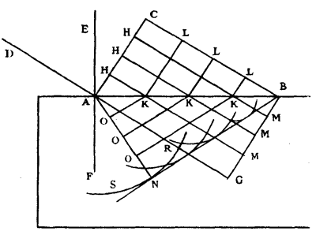

Title: Snell's Law
Date:  05.08.2021
Categories: Physics
#--
*Reference derivation for ["Reflection and Refraction in a Raytracer](../Graphics/reflectionAndRefractionInARaytracer.html).*

Overview
=======================================================================================

Snell's law is a an ancient empircal result, but it can be recovered a priori by a variety of paths (no pun intended)

History
---------------------------------------------------------------------------------------
Wikipedia's [historical summary](https://en.wikipedia.org/wiki/Snell%27s_law#History)

Derivation Methods
---------------------------------------------------------------------------------------
* Ray model & Fermat's principle with calculus
* Ray model & Fermat's principle with variational arguments
* Wavefront model & Huygen's princple with geometry

Ray model & Fermat's principle with calculus
=======================================================================================

Fermat's principle definition
---------------------------------------------------------------------------------------

**Fermat's principle:** 
The path taken by a ray between two given points is the path that can be traversed in the least amount of time.

This is something that is taken for granted now, but it does give pause to think how strange it is to to ascribe behavior to nature and it was quite controversial in its time.

Problem Setup
---------------------------------------------------------------------------------------
<!-- integral of speed with respect to distance was a minimum -->
<!--  -->

    
    
Refraction of light at the interface between two media of different refractive indices

Preliminary values to be used ($d_i$ is the length of the ray):

$$d_1 = \sqrt{a^2 + {x_1}^2}$$
$$d_2 = \sqrt{b^2 + {x_2}^2}$$
$$\sin{\alpha} = \frac{x_1}{d_1} = \frac{x_1}{\sqrt{a^2 + {x_1}^2}}$$
$$\sin{\beta} =  \frac{x_1}{d_2} = \frac{x_2}{\sqrt{b^2 + {x_2}^2}}$$

Speed of ray (where $\eta$ is the respective index of refraction of the medium): $$s_i = \frac{c}{\eta_i}$$

The total time taken for the ray: $$T_{total} = t_1 + t_2$$

Derivation
---------------------------------------------------------------------------------------

Definition of speed: $$s_i = \frac{d_i}{t_i} = \frac{c}{\eta_i}$$
$\implies$ 
$$t_i = \frac{\eta_i}{c} d_i$$
$\implies$ 
$$T_{total} = \frac{\eta_1}{c} d_1 + \frac{\eta_2}{c} d_2$$
$$T_{total} = \frac{\eta_1}{c} \sqrt{a^2 + {x_1}^2} + \frac{\eta_2}{c} \sqrt{b^2 + {x_2}^2}$$

To invoke Fermat's principle, we want to minimize this function (we find a critical point which may or may not be a minimum)
and we need to make a small substituion so that we can take a whole derivative with respect to the distance

<!--  -->

    
    
Setup with substitution for calculus optimization

$$T_{total} = \frac{\eta_1}{c} \sqrt{a^2 + {x_1}^2} + 
              \frac{\eta_2}{c} \sqrt{b^2 + {\left(l - x_1 \right)}^2}$$

Taking a derivative with respect to distance and setting it to zero to find its critical points:
$$ 0 = \frac{1}{2} {\left( a^2 + {x_1}^2 \right)}^{-\frac{1}{2}} 2x_1 \frac{\eta_1}{c} +
       \frac{1}{2} {\left( b^2 + {\left(l - x_1 \right)}^2 \right)}^{-\frac{1}{2}} \left( {2x_1 - 2l} \right) \frac{\eta_1}{c}
$$
$\implies$ 
$$ 0 = \cancel{\frac{1}{2}} {\left( a^2 + {x_1}^2 \right)}^{-\frac{1}{2}} \cancel{2}x_1 \frac{\eta_1}{c} +
       \cancel{\frac{1}{2}} {\left( b^2 + {\left(l - x_1 \right)}^2 \right)}^{-\frac{1}{2}} \cancel{2}\left( {x_1 - l} \right) \frac{\eta_1}{c}
$$

$$ 0 = \frac{x_1}{\sqrt{a^2 + {x_1}^2}} \frac{\eta_1}{\cancel{c}} - 
       \frac{ \left( l - x_1 \right) }{\sqrt{b^2 + {\left(l - x_1 \right)}^2}} \frac{\eta_2}{\cancel{c}}
$$
Referencing our preliminary trig expressions, substitute with $\sin{\alpha}$ and $\sin{\beta}$

$$ 0 = \sin{\alpha} \eta_1 - 
       \sin{\beta}  \eta_2
$$
$\implies$
$$ 
\eta_1 \sin{\alpha} = \eta_2 \sin{\beta}
$$

Ray model & Fermat's principle with variational arguments
=======================================================================================

Wavefront model & Huygen's princple with geometry
=======================================================================================

It feels slightly out of place to bring in Huygen's principle (in the context of geometric optics for computer graphics) 
as it occupies some middle ground between ray and wave representations of light, but intuition and trust in something is built by reaching
the same result from many, disparate paths.

It's also very elegant in that Snell's law pops out as a purely geometrical argument.

Huygen's principle definition
---------------------------------------------------------------------------------------
**Huygen's principle:** 
Every point on a wavefront is itself the source of spherical wavelets, and 
the secondary wavelets emanating from different points mutually interfere.
The sum of these spherical wavelets forms the wavefront. 

Here is a picture of a wavefront as originally conceived by Huygen from Wikipedia

<!--  -->

    
    
Refracted wavefront

Derivation
---------------------------------------------------------------------------------------

Here is a well explained and animated <a href="https://www.youtube.com/watch?v=1GcW9jWj4FM"  target="_blank">derivation</a>,
check it out.